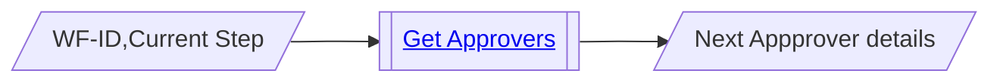
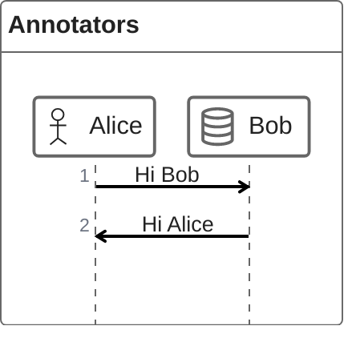
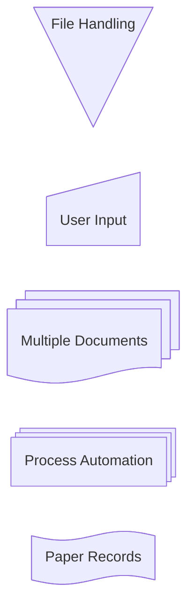
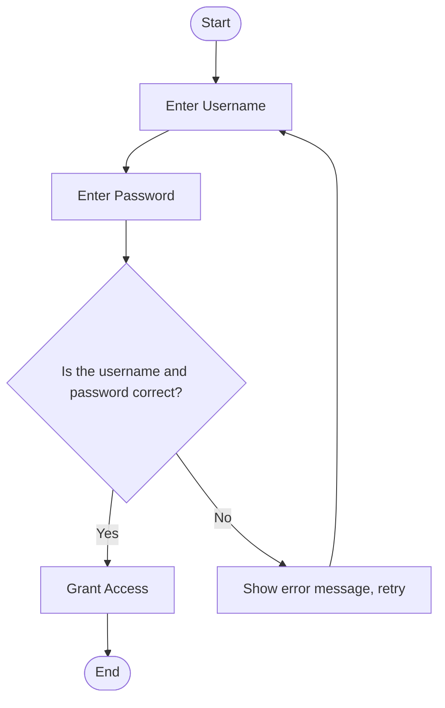
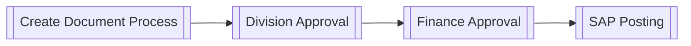
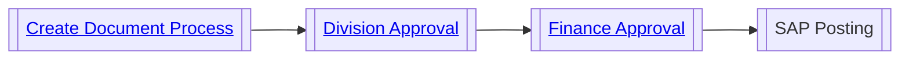

## How To Get Approvers
1	Select Workflow Type from RULTB
2	Get Elemets Selection from ELMTB
3	Supply Value from Document: Need mapping of definition from ELMTB to DB Fields of transaction
4	Loop at PFACT for each element of type PF from document to get responsibility - Responsibility Rule
5	Loop at CL24N table of type CL to get release strategy/release group
6	Input value from #5 to PFACT to get resposibility (RSPNM). 
7	Get position of responsibility from table OMRSP
  Get number of approvers from T16FS from #5
  Get Release strategy from

## TODO
- [ ] Create function for getting approvers

## Mermaid Samples
### Mermaid 11 samples
- This is not supported currently in github

- This is supported

<body>
  <pre class="mermaid">
    flowchart LR
        A-->B
        B-->C
        C-->D
        click A callback "Tooltip"
        click B "https://www.github.com" "This is a link"
        click C call callback() "Tooltip"
        click D href "https://www.github.com" "This is a link"
  </pre>

  
</body>
