This script includes the definitions (DDL) for several tables that form part of a larger application database, probably for user management, role-based access control, and auditing.

Here’s a brief breakdown of the structure:

1. **APPS_USER_REF** - Stores details about users, such as full name, status, and SSO key. 
2. **APPS_SSO_REF** - Contains the mapping between users (UUID) and their Single Sign-On (SSO) keys. 
3. **APPS_USER_MAPPER** - Holds the user login information, including usernames, passwords, and salt keys.
4. **APPS_PERSONNEL_MSTR** - Stores personal information such as email, name, and contact number related to users.
5. **APPS_ROLE_REF** - Defines roles within the application, along with descriptions and their hierarchy.
6. **APPS_USER_ROLE_REF** - Maps users to roles with the status of whether the role is active.
7. **APPS_MODULE_REF** - Defines application modules, their names, parent-child relationships, and other metadata.
8. **APPS_ROLE_MODULE_REF** - Defines the relationship between roles and modules, with authorization settings.
9. **APPS_AUDIT_HDR_REF** and **APPS_AUDIT_DTL_REF** - Provide an auditing mechanism to track changes made by users to tables, storing details about the type of action (insert, update, delete), and the changed values.
10. **APPS_USER_SESSION** - Stores details about user sessions (e.g., login, logout, session times).
11. **APPS_USER_MODULE_LOGS** - Tracks which modules the user interacts with.
12. **APPS_MODULE_FLDS_REF** - Refers to fields within a module and their settings.
13. **APPS_MODULE_AUTH_REF** - Stores authorization settings for modules.
14. **APPS_ROLE_MODULE_FLDS_REF** - Relates roles to specific fields in modules, detailing field-level access permissions.
15. **APPS_ROLE_MODULE_AUTH_REF** - Specifies which roles have which authorizations on specific modules.

### Key Design Elements:
- Foreign Key Constraints: Many tables reference `APPS_USER_REF` for user-specific data and `APPS_ROLE_REF`, `APPS_MODULE_REF` for role-based permissions.
- The use of **UUID** (numeric, not necessarily universally unique) to link most of the tables is central to this schema.
- **Audit tables**: They provide a historical log of changes made by users, which is crucial for tracking and maintaining data integrity.

Would you like help modifying this schema, or are you looking to clarify any specific table or relationship?

Here’s a basic ERD (Entity-Relationship Diagram) for the schema you provided, formatted using Mermaid.js syntax:

```mermaid
erDiagram
    APPS_USER_REF {
        numeric UUID PK
        varchar FULLNAME
        numeric DEFMOD
        char IS_ACTIVE
        numeric CREATED_BY
        date CREATED_DATE
        numeric LAST_UPD_BY
        date LAST_UPD_DATE
        varchar SSO_KEY
    }
    APPS_SSO_REF {
        numeric UUID FK
        varchar SSO_KEY PK
        char IS_ACTIVE
        numeric CREATED_BY
        date CREATED_DATE
        numeric LAST_UPD_BY
        date LAST_UPD_DATE
    }
    APPS_USER_MAPPER {
        numeric UUID FK
        varchar USERNAME
        nvarchar PASSWORD
        nvarchar SALTKEY
        char IS_ACTIVE
        numeric CREATED_BY
        date CREATED_DATE
        numeric LAST_UPD_BY
        date LAST_UPD_DATE
    }
    APPS_PERSONNEL_MSTR {
        numeric UUID FK
        varchar EMAIL
        varchar LASTNAME
        varchar FIRSTNAME
        varchar CONTACTNO
        char IS_ACTIVE
        numeric CREATED_BY
        date CREATED_DATE
        numeric LAST_UPD_BY
        date LAST_UPD_DATE
    }
    APPS_ROLE_REF {
        numeric ROLE_ID PK
        varchar ROLE_NAME
        varchar ROLE_DESCRIPTION
        numeric PARENT_ID
        char IS_ACTIVE
        char IS_ADMIN
        numeric CREATED_BY
        date CREATED_DATE
        numeric LAST_UPD_BY
        date LAST_UPD_DATE
    }
    APPS_USER_ROLE_REF {
        numeric UUID FK
        numeric ROLE_ID FK
        char IS_ACTIVE
        numeric CREATED_BY
        date CREATED_DATE
        numeric LAST_UPD_BY
        date LAST_UPD_DATE
    }
    APPS_MODULE_REF {
        numeric MODULE_ID PK
        varchar MODULE_NAME
        numeric PARENT_ID
        numeric MENU_LEVEL
        numeric SORT_ORDER
        varchar FORM_NAME
        varchar PAGE_NAME
        varchar FOLDER_PATH
        char IS_PARENT
        varchar CODE
        char IS_ACTIVE
        char IS_ADMIN
        numeric CREATED_BY
        date CREATED_DATE
        numeric LAST_UPD_BY
        date LAST_UPD_DATE
    }
    APPS_ROLE_MODULE_REF {
        numeric ROLE_ID FK
        numeric MODULE_ID FK
        char AUTOHRZTN
        char IS_ACTIVE
        numeric CREATED_BY
        date CREATED_DATE
        numeric LAST_UPD_BY
        date LAST_UPD_DATE
    }
    APPS_AUDIT_HDR_REF {
        numeric AUDIT_ID PK
        char ActionType
        varchar USER_NAME
        varchar COMP_NAME
        numeric MODULE_ID
        varchar TableName
        varchar table_key
        varchar ActionRmrk
        numeric CREATED_BY
        date CREATED_DATE
    }
    APPS_AUDIT_DTL_REF {
        numeric AUDIT_ID FK
        numeric LINENUBR PK
        varchar FIELDNAM PK
        varchar OLDVALUE
        varchar NEWVALUE
    }
    APPS_USER_SESSION {
        varchar SESSONID PK
        varchar USERNAME
        date logindate
        char logintime
        varchar CMPRNAME
        numeric UUID FK
        varchar SRVRNAME
        char IS_ACTIVE
        date deactdate
        char deacttime
    }
    APPS_USER_MODULE_LOGS {
        numeric MODULE_ID FK
        numeric UUID FK
        date LOG_DATE
        char TIME
        varchar USERNAME
        varchar CMPRNAME
        varchar SRVRNAME
    }
    APPS_MODULE_FLDS_REF {
        numeric MODULE_ID FK
        varchar FIELD_NAME
        char IS_ACTIVE
        numeric CREATED_BY
        date CREATED_DATE
        numeric LAST_UPD_BY
        date LAST_UPD_DATE
    }
    APPS_MODULE_AUTH_REF {
        numeric MODULE_ID FK
        varchar AUTH_NAME
        char OBJTYPE
        char IS_ACTIVE
        numeric CREATED_BY
        date CREATED_DATE
        numeric LAST_UPD_BY
        date LAST_UPD_DATE
    }
    APPS_ROLE_MODULE_FLDS_REF {
        numeric ROLE_ID FK
        numeric MODULE_ID FK
        varchar FIELD_NAME
        char VALUE
        numeric CREATED_BY
        date CREATED_DATE
        numeric LAST_UPD_BY
        date LAST_UPD_DATE
        char IS_ACTIVE
    }
    APPS_ROLE_MODULE_AUTH_REF {
        numeric ROLE_ID FK
        numeric MODULE_ID FK
        varchar AUTH_NAME
        varchar VALUE
        char IS_ACTIVE
        numeric CREATED_BY
        date CREATED_DATE
        numeric LAST_UPD_BY
        date LAST_UPD_DATE
    }

    APPS_USER_REF ||--o| APPS_SSO_REF : has
    APPS_USER_REF ||--o| APPS_USER_MAPPER : has
    APPS_USER_REF ||--o| APPS_PERSONNEL_MSTR : has
    APPS_USER_REF ||--o| APPS_USER_ROLE_REF : has
    APPS_ROLE_REF ||--o| APPS_USER_ROLE_REF : contains
    APPS_USER_REF ||--o| APPS_ROLE_REF : created_by
    APPS_USER_REF ||--o| APPS_ROLE_MODULE_REF : created_by
    APPS_ROLE_REF ||--o| APPS_ROLE_MODULE_REF : contains
    APPS_MODULE_REF ||--o| APPS_ROLE_MODULE_REF : contains
    APPS_ROLE_REF ||--o| APPS_ROLE_MODULE_FLDS_REF : contains
    APPS_MODULE_REF ||--o| APPS_ROLE_MODULE_FLDS_REF : contains
    APPS_USER_REF ||--o| APPS_MODULE_REF : created_by
    APPS_USER_REF ||--o| APPS_ROLE_MODULE_AUTH_REF : created_by
    APPS_ROLE_REF ||--o| APPS_ROLE_MODULE_AUTH_REF : contains
    APPS_MODULE_REF ||--o| APPS_ROLE_MODULE_AUTH_REF : contains
    APPS_USER_REF ||--o| APPS_AUDIT_HDR_REF : created_by
    APPS_AUDIT_HDR_REF ||--o| APPS_AUDIT_DTL_REF : contains
    APPS_USER_REF ||--o| APPS_USER_SESSION : has
    APPS_USER_REF ||--o| APPS_USER_MODULE_LOGS : logs
    APPS_MODULE_REF ||--o| APPS_USER_MODULE_LOGS : logs
    APPS_MODULE_REF ||--o| APPS_MODULE_FLDS_REF : contains
    APPS_MODULE_REF ||--o| APPS_MODULE_AUTH_REF : contains
```

### Explanation:
- **Entities**: Each table is represented as an entity, and the fields in each table are listed inside the block for that entity.
- **Relationships**: Relationships between entities are shown as lines with labels like `has`, `contains`, and `created_by`, indicating how entities are related to each other (for example, `APPS_USER_REF` to `APPS_SSO_REF` is a one-to-many relationship).
- **Primary and Foreign Keys**: Keys are indicated as `PK` (Primary Key) and `FK` (Foreign Key), specifying which fields are involved in the relationships.

You can use this Mermaid.js code in a Mermaid-supported tool or online editor like [Mermaid Live Editor](https://mermaid-js.github.io/mermaid-live-editor/) to visualize the ERD.
